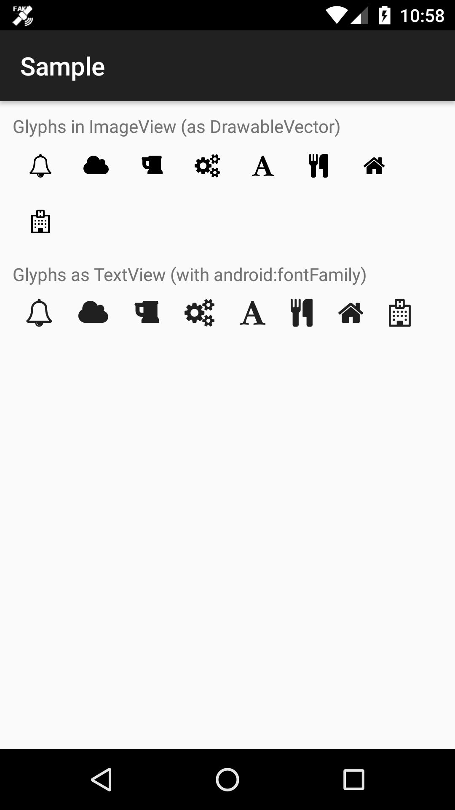

# android-fontawesome
An Android library port of [Font-Awesome](https://github.com/FortAwesome/Font-Awesome).

## How it works
This library recompiles `Font-Awesome` to provide:
- A ready to use set of `VectorDrawable` icons, check for any `@drawable/ic_glyph_*`.
- A ready to use `font` resource, to be applied on `TextView`'s `android:fontFamily="@font/fontawesome"` attribute.

Note: if you are targeting API 25 or below, you have to setup `AppCompat` library as well to allow `android:fontFamily` attribute to work.

## Import
### As a Gradle dependency
On your `build.gradle` add:
```groovy
    dependencies {
        implementation 'com.github.gmazzo:android-fontawesome:0.1'
    }
```
[  ](https://bintray.com/gmazzo/maven/android-fontawesome/_latestVersion)

Pros:
- Ready to use library
- Improved build time

Cons:
- As it's pre-built, it may be outdated against latest `Font-Awesome` release.

### As a Gradle module
1. Checkout or clone the repo
2. Copy the 'library' folder into your app root directory
3. In your 'settings.gradle' add:
```groovy
include ':library'
```

Pros:
- Library is updated on each build

Cons:
- Increased build time

## Usage
Referencing Glyphs as `Drawables` inside an `ImageView` (or any other drawable capable view)
```xml
<ImageView
        android:layout_width="wrap_content"
        android:layout_height="wrap_content"
        android:src="@drawable/ic_glyph_hospital" />
```

Referencing Glyphs as inside an `TextView`
```xml
<TextView
        android:layout_width="wrap_content"
        android:layout_height="wrap_content"
        android:fontFamily="@font/fontawesome"
        android:text="@string/glyph_hospital" />
```

## Demo

